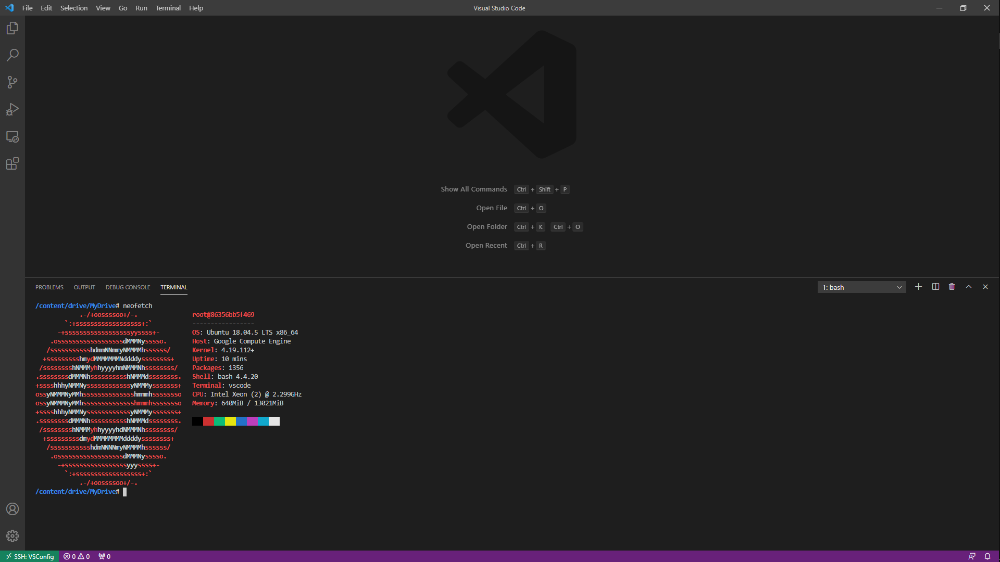
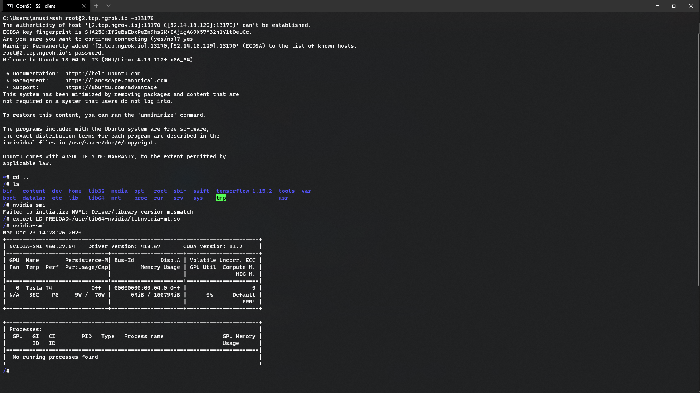
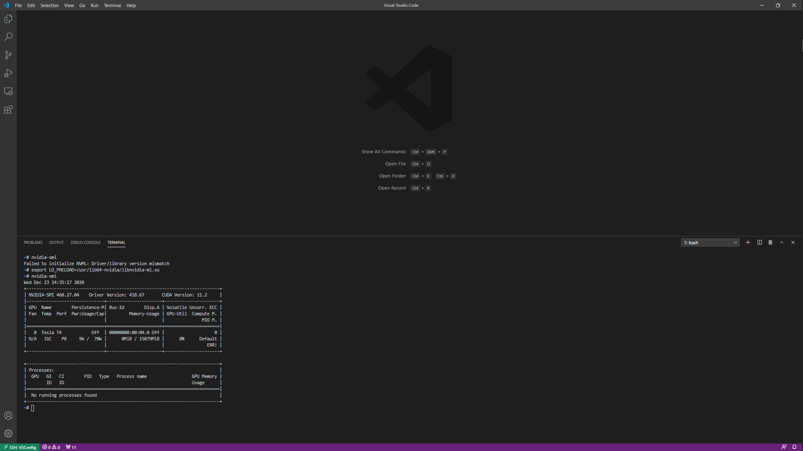

# VSColab

Use Google Colab GPU's and TPU's via an ssh connection locally in your device.

[](/LICENSE)


### Installation:

Installation is easy!

```
$ pip install VSColab
```

Using this package we can ssh into the Google Colab instance and also perform remote developement using VSCode.

### Getting Started:

- Install the package
- Use the `Connect()` function to create an Ngrok tunnel, by passing a password string as a parameter.
- Then Enter the Authentication Key (which can be obtained from:https://dashboard.ngrok.com/auth/your-authtoken) and press Enter.
- Use the `VSconfig()` function to get the contents for the VSCode Config file, by passing the URL of the Ngrok tunnel (which can be obtained from: https://dashboard.ngrok.com/status/tunnels)
- To kill the tunnel, use the `Kill()` function.

### Colab starter notebook:

[](https://colab.research.google.com/drive/1tZki6bp9x81jzn05zczR7aK03owsAscd?usp=sharing)

### Remote development with VSCode:

- First create a tunnel using the `Connect()` function.
- Use the `VSconfig()` function to get the contents for the VSCode Config file, by passing the URL of the Ngrok tunnel (which can be obtained from: https://dashboard.ngrok.com/status/tunnels) and copy the Output.
- Then install the **remote-ssh** plugin in VSCode, and click the button at the bottom left corner.
- Then select the **Open Configuration Files..** option and enter the copied text there.
- Then select the **Connect to Host..** option and Enter the password when asked.
- **Viola!! A fully functional Development environment powered by the GPU's and TPU's of Google Colab**





### Note:

If the command `$ nvidia-smi` doesn't work in the ssh session, simply type :

```
export LD_PRELOAD=/usr/lib64-nvidia/libnvidia-ml.so
```

Then press Enter.
